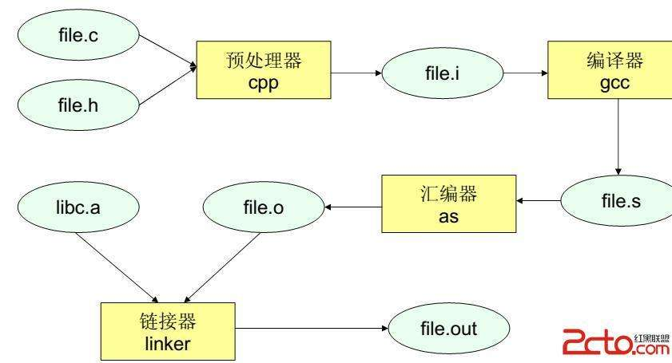

# 潜器C编程

[toc]

## C语言开发


### 程序编译过程





https://www.cnblogs.com/CarpenterLee/p/5994681.html

```c
// hello.c
#include <stdio.h>
int main(){
    printf("hello world!\n");
}
```

预编译：gcc -E -I *** hello.c -o hello.i

编译：gcc -S -I *** hello.i -o hello.s

汇编：as hello.s -o hello.o

链接：ld -dynamic-linker /lib64/ld-linux-x86-64.so.2 -o hello /usr/lib/x86_64-linux-gnu/crt1.o /usr/lib/x86_64-linux-gnu/crti.o /usr/lib/x86_64-linux-gnu/crtn.o hello .o -L/usr/lib64  -lc


### 链接库

动态链接库——Dynamic Linkable Library——运行期间调用

Windows：.dll

Linux: .so

静态链接库——Static Linkable Library——编译期间调用

Windows：.lib

Linux: .a


## CMake使用


### 基本语法

set(CMAKE_C_STANDARD 99)   # 设置C语言标准

include_directories：增加头文件查找路径

aux_source_directory

FILE(GLOB SOURCE_FILES *.h *.c  ...）

link_directories:  增加链接库查找路径

set(CAN_MOTOR_LIBS libcanfestival_unix.a;libcanfestival.a)

add_executable : 生成可执行文件

target_link_libraries： 增加链接库

add_subdirectory

add_library：生成链接库


## 值传递与引用传递

深拷贝与浅拷贝